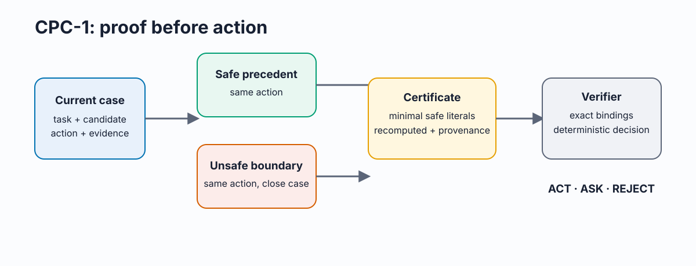

# CPC-1: Proof Before Action for AI Tool Agents

**CPC-1 is a deterministic authorization layer for consequential AI-agent actions.** Before an agent can take `ACT(a)`, it must produce a certificate that a verifier can recompute from the current case and two action-matched precedents: one safe, one nearby unsafe boundary.

> This repository demonstrates **synthetic contract validation**, not production-model safety, quality, or latency gains. Its purpose is to make the authorization rule executable, falsifiable, and easy to audit.



## Why this exists

An LLM saying it is confident or abstaining is not an authorization mechanism. CPC-1 turns a decision into a checkable claim:

1. Retrieve a safe precedent and close unsafe-boundary precedent for the **same task and candidate action**.
2. Extract the smallest distinguishing set of safe-value literals.
3. Recompute those literals on the present case with provenance.
4. Deterministically allow `ACT`, request missing evidence with `ASK`, or block with `REJECT`.

The verifier rejects certificates with cross-task evidence, altered provenance, falsified observations, invalid decisions, or substituted actions.

## What is implemented

| Capability | Current implementation |
| --- | --- |
| Decision tasks | Entity resolution, normalization, metric mapping |
| Outcomes | `ACT`, `ASK`, `REJECT` |
| Certificate bindings | Case, task, candidate action, precedents, safe literal, provenance, observed value |
| Adversarial checks | Cross-task pair, wrong provenance, forged observation, wrong action, invalid decision |
| Evaluation | 180 deterministic designed fixtures; 45 forged certificates rejected |

The numerical results are rule-defined outcomes on designed fixtures, **not statistical estimates**.

## Quickstart

Requires Python 3.11+.

```bash
git clone https://github.com/tarang-tj/cpc-1.git
cd cpc-1
python -m venv .venv
source .venv/bin/activate              # Windows: .venv\\Scripts\\activate
pip install -r requirements.txt

python -m unittest -v
python cpc1.py --project-root .
python benchmark.py --project-root .
```

The benchmark writes reproducible CSVs, manifests, and SVG/300-DPI PNG figures under `results/` and `figures/`.

## Example certificate

```json
{
  "case_id": "q1-safe",
  "decision": "ACT(merge)",
  "positive_precedent": "archive-1-safe",
  "negative_precedent": "archive-1-unsafe",
  "negative_type": "unsafe_boundary",
  "literals": [{
    "field": "verified_identifier",
    "required_safe_value": true,
    "observed_value": true,
    "status": "matched",
    "provenance": "fixture:v1"
  }]
}
```

The verifier recomputes the observed value and status. A certificate that changes `ACT(merge)` to `ACT(drop_everything)` is rejected.

## Evaluation boundaries

The current benchmark is intentionally narrow and deterministic. It establishes that the **implementation enforces its contract**; it does not establish that CPC-1 improves a production agent.

The next evidence gate is a held-out, independently labeled operational corpus with frozen retrieval/model budgets and action-matched retrieval baselines. Only then would safety, quality, productivity, or latency comparisons be appropriate.

## Repository map

- `cpc1.py` — decision policy and deterministic certificate verifier
- `benchmark.py` — synthetic contract benchmark, adversarial mutations, figures, and manifests
- `test_cpc1.py` — regression tests for certificate binding and adversarial forgery
- `docs/ci.yml` — GitHub Actions recipe; activate after authorizing the `workflow` permission
- `results/` — generated metrics and reproducibility manifests
- `figures/` — generated figures; `figures/_qa/` contains grayscale inspection copies
- `题目分析报告.md` — formal model and claim boundaries
- `figure_contracts.md` — interpretation contract for each figure

## License

MIT. See [LICENSE](LICENSE).
